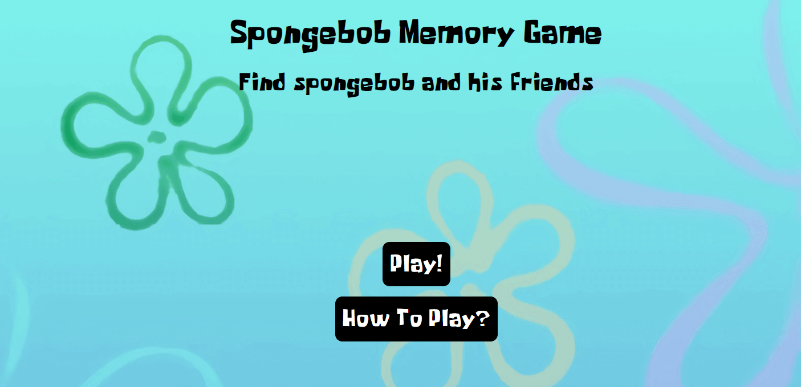
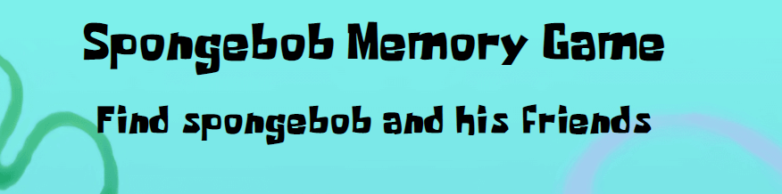
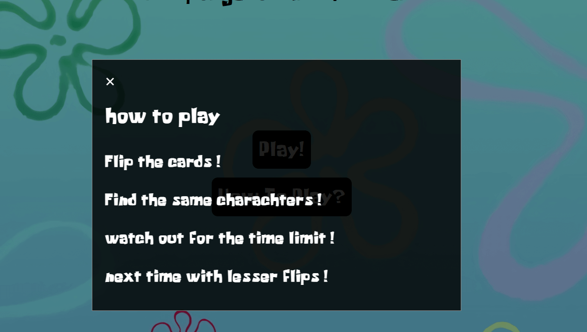
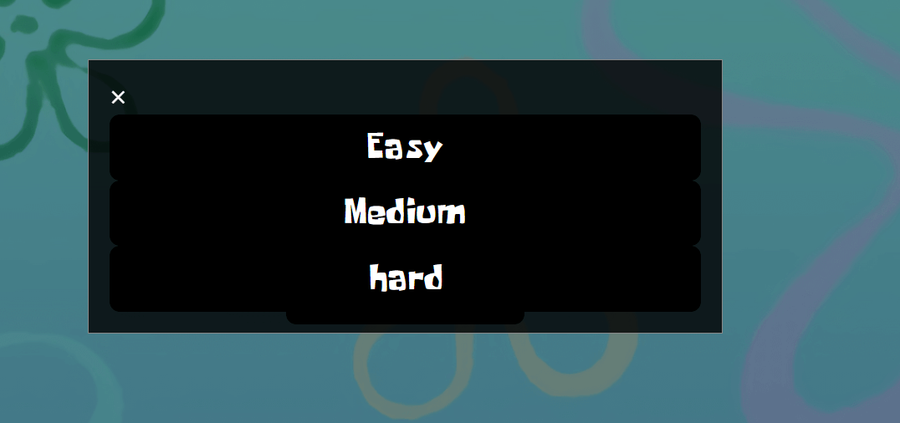
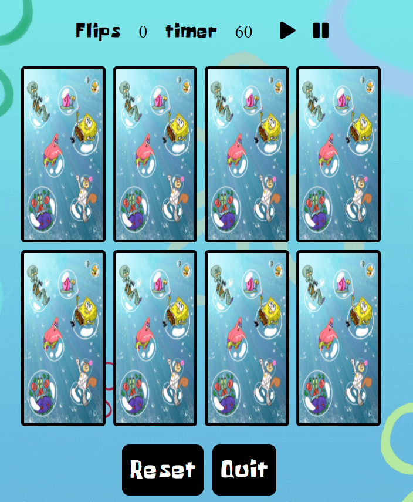
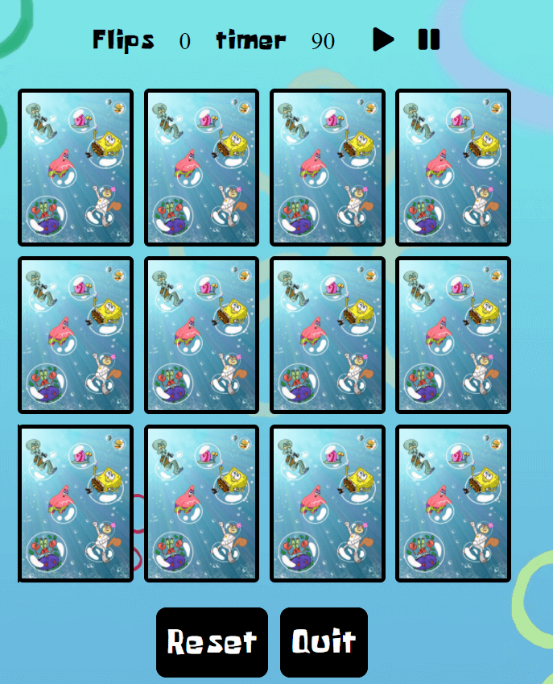
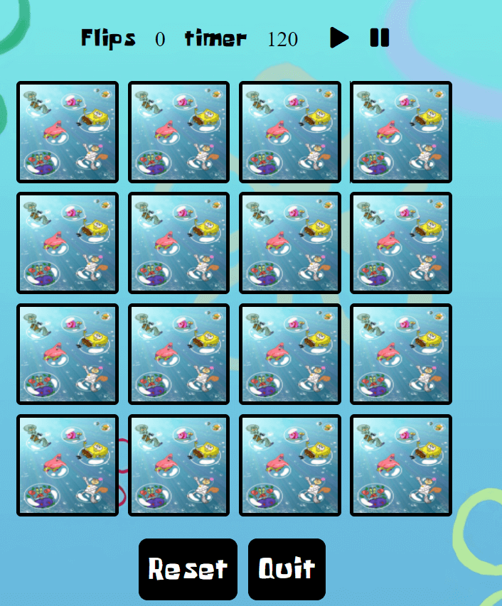
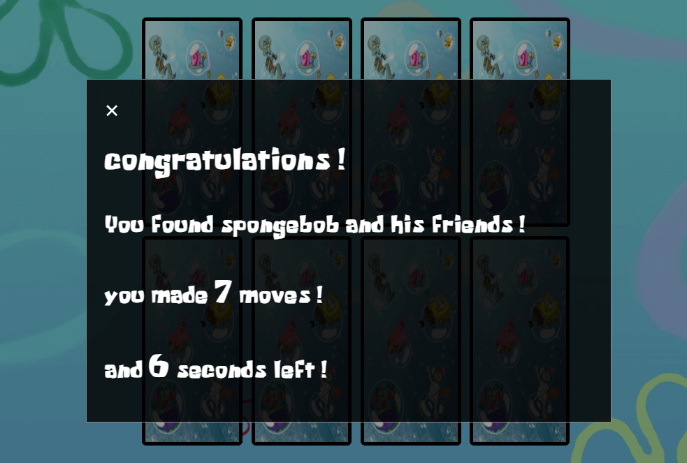
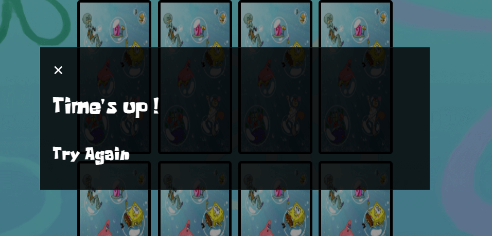

# Spongebob Memory Game
## 1. Purpose of the project
This site is made for kids who want to relax and play a Spongebob game. Because the children are already familiar with the characters, remembering is a bit easier. So I also made more difficult levels and a countdown timer to make it more challenging. They can also listen to the Spongebob theme song while they are playing.  

Users of this website will be able to read how to play and then choose a difficulty. while the user is playing the user can see how many flips they made and how much time is over. The user can also click on play at the top of the game to listen to the Spongebob theme song or click pause if they don't want to listen. The users can reset the game if they want and start over, they also can quit the game and choose another difficulty. When the user found all the matches they gonna get a congratulations message where they can see how many moves they made and how much time is left.

## here comes the i am responsive pictures
for the live site click
[here](https://mustafasahinci.github.io/Code-Institute-Second-Project/)

# 2. User stories
- As a game player, I would like to read first how to play the game.
- As a game player, I would like to choose the difficulty.
- As a game player, I would like to choose if I want to listen to the song or not.
- As a game player, I would like to flip the cards and find the matches.
- As a game player, I would like to see how many flips I am making and see how much time is left.
- As a game player, I would like to see a message after I win the game where I can see how many moves I did and how much time is left.
- As a game player, I would like to switch between the difficulty levels and reset the game and start over.

# 3. Features
## Home page

## Header
Featured at the top of the page, the Spongebob memory game logo and heading is easy to see for the user. Upon viewing the page, the user will be able to see the name of the game. The header is the same on all the pages.

## buttons and modals
when the user clicks on the buttons they can see a modal. If they press the how to play button they can read how to play. If they press the play button they can choose a level to go to the game, The user can choose out of 3 levels easy,medium and hard. They can close the modal by pressing the cross or clicking anywhere outside the modal.

## The game and levels
The user can play the game here, When the user clicks on the first card the countdown starts. The user must find all the matches to win the game. The countdown for easy mode is 60 seconds, for medium mode it is 90 seconds and for hard mode it is 120 seconds.

## flip, timer and play, pause buttons
The user can see here how many flips he made, how much time is left and can click on the play button to start the song or the pause button to pause it.

## reset and quit button
The user can reset the game here and start over, and the user can click quit to go to the home page and choose another difficulty.

## modal after win and times up
When the user wins the game a modal is gonna pop up with congratulations message, the user can see how many flips he made and how much time is left

if the user doesn't find all the matches in time, the user gets a modal message to try again

# 4. Future features
- a high score section
- a price every week for the best high score
- Sound when the cards are clicked
- style the modal different with a picture of Spongebob

# 5. Typography and color scheme
I used the Spongebob font which I found on https://www.fontspace.com/,
And for the colors and theme I choose a Spongebob background with blue colors to represent the sea. The images for the characters are without background so it looks better in the cards.  

# 6. wireframes
## add later ----------------

# 7. Technology

# 8. testing 

# 9. Deployment

# 10. credits

pictures from google
font from https://www.fontspace.com/
modal from ws3
stackoverflow